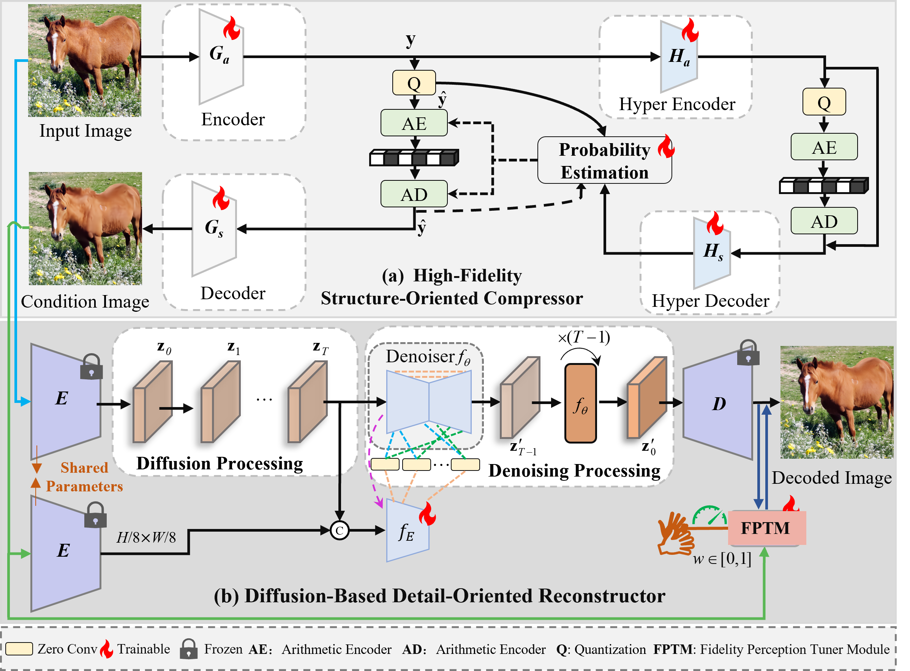

## From structure to detail: A conditional diffusion framework for extremely low-bitrate image compression

《Signal Processing》 ---- [Paper](https://www.sciencedirect.com/science/article/abs/pii/S0165168425005961) 


---

<p align="center">
    
</p>

*** If FPD-IC is helpful for you, please help star this repo. Thanks!

## Testing

### 1. Generation Condition image 
``` 
 sh ./scripts_tmp/test_S1_TCM.sh DATASET lambda   #DATASET= ["kodak", "Tecnick"] lambda = [0.00015   0.00025  0.0005 0.001]
``` 
#### 2. Reconstructor

``` 
  (1) Modify： the "file_gt" and  "file_lq" in configs/inference_tmp/LIC_LDM.yaml to  the printed pathway after runing "1.Generation Condition image"
  (2) sh ./scripts_tmp/test_S2_LDM.sh  DATASET lambda   #DATASET= ["kodak", "Tecnick"] lambda = [0.00015   0.00025  0.0005 0.001]
``` 

## Training
### 1. Basic Compression Model Training
``` 

 sh ./scriptsEn/train.sh 
``` 
### 2. DM-based Details Recovery Training
``` 
sh ./scriptsEn/train2.sh 
``` 

 Note: Condition image output diretion： file_lq  FPD-IC  output diretion： results_tmp/DATASET_${lambda}/


<p align="center">
    
</p>


## Citation

Please cite us if our work is useful for your research.

```
@article{LI2026110480,
title = {From structure to detail: A conditional diffusion framework for extremely low-bitrate image compression},
journal = {Signal Processing},
volume = {243},
pages = {110480},
year = {2026},
issn = {0165-1684},
doi = {https://doi.org/10.1016/j.sigpro.2025.110480},
url = {https://www.sciencedirect.com/science/article/pii/S0165168425005961},
}
```

## License

This project is released under the [Apache 2.0 license](LICENSE).

## Acknowledgement

This project is based on [ControlNet](https://github.com/lllyasviel/ControlNet), [DIFFBIR](https://www.bing.com/search?q=DiffBIR&form=ANNTH1&refig=69cb2fb0075b4b568b84e93f2b93a08b&pc=CNNDDB&adppc=EDGEESS) and [BasicSR](https://github.com/XPixelGroup/BasicSR). Thanks for their awesome work.

## Contact

If you have any questions, please feel free to contact with me at 105830@xaut.edu.cn.
